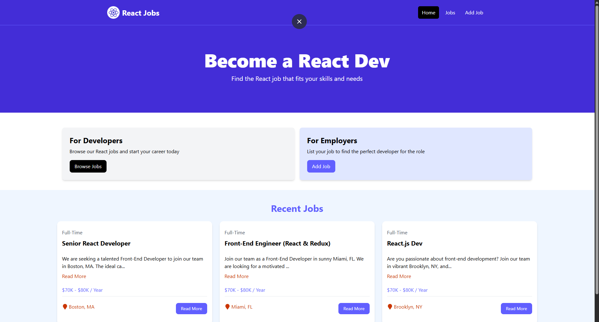

## Job Browser

## Live Demo

https://ibrahimrabiee.github.io/job-browser-platform/

A modern React application for browsing and exploring job opportunities through an intuitive and responsive user interface.

## Features
- Browse available job listings
- Search jobs by keyword
- View detailed job information
- Responsive design for desktop and mobile devices
- Dynamic data fetching from external APIs

## Technologies
- React.js
- React Router
- JavaScript
- CSS / Tailwind CSS
- REST APIs

## Screenshot

## Installation
- npm install
- npm run dev

## What I Learned
- React component architecture
- State management
- API integration
- Client-side routing
- Responsive UI development

## Future Improvements
- User authentication
- Saved jobs functionality
- Backend integration
- Job application tracking
- Personalized recommendations
- Database support
